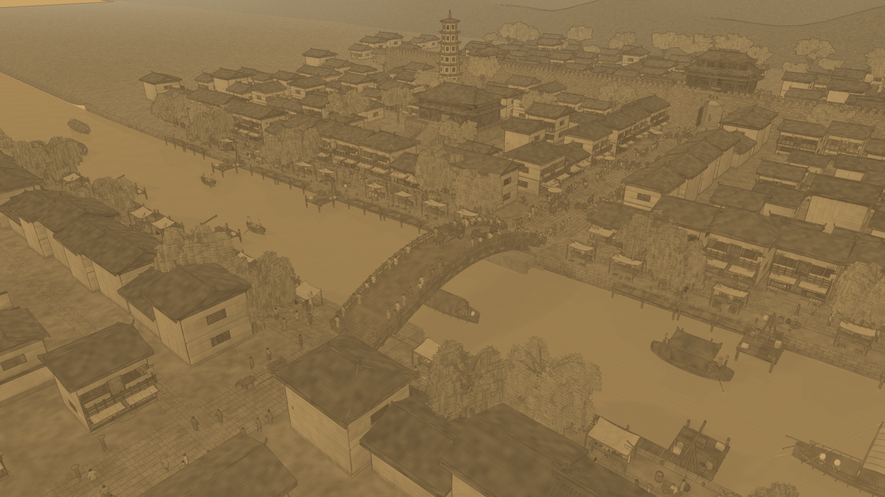
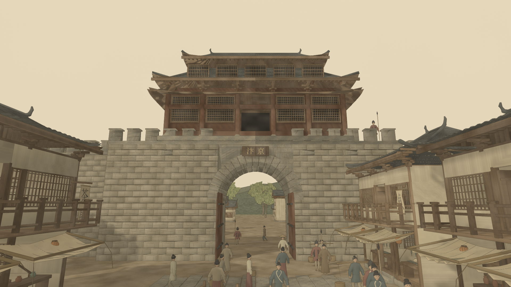

# 建筑、切镜头与水体修复 · 2026-09-12

本轮恢复了城门、房屋结构和完整屋顶，修复切镜头时反复编译，水体接入三画风。**30 fps / P95≤40ms 尚未通过；结构恢复后的三角预算也未通过。** 当前版本可供画质复查，不应作为性能验收通过的版本。

## 修复内容

- 原减面先按面积丢弃独立部件，再全体坍塌，误删屋梁、窗格、屋面并把门洞石块压成尖片。建筑改为按独立部件减面；保留每个部件，轴向范围缩小超过5%时保留该部件原形。三个LOD的面数不增加。建筑6000面硬门槛已撤销，避免再次破坏结构。
- 另一个破面来源是密集瓦片被缩成零散岛。近景屋顶保留原始瓦片；中远景按整屋生成封闭外壳，三种瓦色同步切换，避免屋顶穿洞。整屋阈值400/120px。虹桥护栏、桥面、桥拱继续保留原始几何。
- 点光源数量曾随相机变化，导致材质程序组合爆炸。全画卷模式不编译无贡献点光源；PBR保持六个固定光源槽，改变强度。材质程序键按实际代码区分，颜色/贴图材质仍独立。加载时通过十镜头完整通道预热阴影、描边及主材质；生态保持冻结，准备结束后正常运行。
- 水体和飞溅共享纸色、墨色、饱和度、颜料浓度与画卷强度。Antique Silk 的水面成为绢色淡墨，浪花采用纸色；保留倒影明暗与断续水纹。Light Color 使用淡彩水色，Original Materials 输出物理水色。没有改水场、舟船和取样语义。

## 切镜头证据

原生 Chrome，1920×1080，正常应用循环，每次通过UI切换并采样3.2秒，Overview/Gate/Joinery/Bridge两轮。计时不插入gl.finish或截图；截图在采样结束后进行。测得的是引擎回调耗时，不能代替浏览器呈现帧率。各轮有其他工程/模拟器占用，且建筑几何和水体发生变化，不能解释为严格隔离的整体提速百分比。

| 状态 | 八次切镜头期间新增 compileShader | 程序数 | 最慢引擎回调 |
| --- | ---: | --- | ---: |
| 修复前 | 2066 | 243→1276 | 4601.8 ms |
| 仅固定点光布局 | 174 | 243→330 | 948.0 ms |
| 缓存键与普通预编译 | 152 | 254→330 | 891.4 ms |
| 补齐完整通道预热及水体修复 | 0 | 固定331 | 188.3 ms |

预热消除了本次复现的切镜头编译尖峰，但长帧仍存在。最新每个3.2秒窗口的getBufferSubData累计约0.36–1.52秒（包括驱动等待）；实例更新、生态和动作更新也有成本。**没有隐藏浏览器Violation警告，也没有声称警告清零。** 新材质/质量模式首次使用仍可能编译，本次零编译结论仅覆盖默认Auto画卷的八次镜头切换。

## 当前几何预算

保持所有独立部件显著提高了面数；恢复结构的当前策略过于保守，连室内小配件也被保留。下一步需要按结构与装饰语义生成中远景，并烘焙细节，不能再次全体按面积截断。以下为十镜头暂停下强制完整刷新，包含主画面、阴影、倒影、描边等通道；不是正常循环平均值。

| 镜头（1起） | 主画面三角 | 完整刷新三角 | 完整刷新调用 |
| --- | ---: | ---: | ---: |
| 1 | 5,804,493 | 24,768,033 | 942 |
| 2 | 5,215,872 | 17,423,825 | 873 |
| 3 | 4,345,893 | 14,426,721 | 962 |
| 4 | 1,112,359 | 4,430,549 | 579 |
| 5 | 3,905,233 | 12,680,989 | 622 |
| 6 | 4,008,351 | 16,571,679 | 936 |
| 7 | 1,864,505 | 6,634,723 | 342 |
| 8 | 3,737,208 | 12,318,233 | 623 |
| 9 | 4,657,583 | 15,121,748 | 968 |
| 10 | 3,313,855 | 10,752,253 | 411 |

主画面最大5,804,493（预算1,500,000），完整刷新最大24,768,033（预算8,000,000），完整刷新调用最大968。三角预算明显未通过；全通道正常循环均值和两轮绝对帧率验收仍待完成。上一阶段约1.59M/5.96M的计数不再描述当前版本。

## 检查与回退

- `npm test`通过，包括584NPC/1440动作姿态、门网格、批次及固定光源/程序代码共享契约。
- 建筑独立部件Blender回归、资产面数/权重/索引/封闭屋顶检查通过；未再改生成资产后不重复执行相同检查。
- 最终42项GPU检查、三画风十镜头、质量往返、窗口缩放、桥体Auto/Cinema索引一致通过；无页面或WebGL错误。
- 水体专用浏览器检查覆盖两档质量、三画风及往返，确认水面与飞溅共享实时参数，切换不推进生态/水场。三张实拍已目视复查。
- `node tests/package.mjs`通过：5个GLB、35张纹理、4份Blender源、SoA一致性和HTTP资源检查。原始制作资产保留。
- 前一阶段4K导出/录像检查见历史报告；本轮未重新录制十秒视频，不能将旧结果说成本轮新测量。

运行时几何7,765,481顶点、23,468,283索引；SoA451,085,260字节，gzip122,508,736字节。Auto detail GLB73,236,864字节。NPC预算仍为最大2903/963/285，人口584不变。

当前匹配快照：`backup/landmarks-water-source-20260912.tar.gz`、`backup/landmarks-water-assets-20260912.tar.gz`。修复前回退使用`pre-landmark-switch-source-20260912.tar.gz`与`auto-30fps-cloth-assets-20260912.tar.gz`；代码与资产成对还原。

原始结果、复现脚本与源差异在 [检查目录](repairs-20260912/README.md)。待办：结构/装饰分离的中远景预算、回读等待瓶颈、两轮原生1080p真实循环和呈现轨迹验收。
